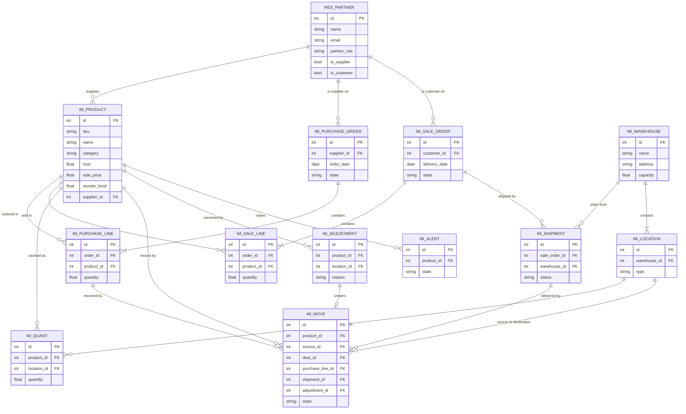

# Inventory Management

An Odoo inventory app (`inventory_management`) with its own OWL dashboard, plus a planned **MCP server** (`odoo-mcp`) that lets an AI assistant check stock and create stock moves through Odoo's own access rules.

## Status: Ongoing / Not Complete

This is an active, in-progress project. It is **not** production-ready. Core data models (products, categories, partner roles, warehouses, locations) and a data-backed dashboard are implemented; purchasing, sales/adjustments, real role-based access, and the MCP connector land in later changes.

## Naming note

This project was originally called "Stock Pilot". It has been renamed to **Inventory Management** to match this repository's name; the module technical name is `inventory_management` (previously `stock_pilot`).

## Odoo version note

This scaffold and its Docker environment run **Odoo 19**, per explicit project decision (the plan below was originally written against Odoo 18).

## Addons layout: `addons/` vs `extra-addons/`

- **`addons/`** — this project's own code (`inventory_management`). Committed to git.
- **`extra-addons/`** — third-party (OCA) modules. **Gitignored**, not committed — fetched on demand by `scripts/fetch-extra-addons.sh` (see below), so the repo doesn't vendor other people's source in git history.

### Included third-party module: OCA Web Responsive

[OCA's `web_responsive`](https://github.com/OCA/web/tree/19.0/web_responsive) (LGPL-3, © LasLabs, Tecnativa, ITerra, Onestein and other OCA contributors, unmodified, `19.0` branch) restores Odoo Enterprise's icon-grid app launcher/home menu in Community Edition. Fetched into `extra-addons/web_responsive/` by the script below. Installed independently — **not** a dependency of `inventory_management` — so `inventory_management` keeps depending only on `base` and `mail` as designed. Optional, but recommended for a nicer UI.

Fetch it (and any future OCA modules the script is extended to cover):
```bash
./scripts/fetch-extra-addons.sh
```
Safe to re-run — it skips any module already present in `extra-addons/`.

## Project Plan

### Goal

Build **Inventory Management**, a simple inventory app for Odoo with its own OWL dashboard, plus an **MCP server** that lets an AI assistant check stock and create stock moves through Odoo's own access rules. Plan for about 10 weeks of evenings and weekends. The data model follows the standard inventory ER designs from GeeksforGeeks and Kladana (see Sources).

- **Odoo module** (`inventory_management`): shows models, security, views, wizards, cron and **OWL frontend** work, which your resume does not show yet.
- **MCP connector** (`odoo-mcp`): shows API design, authentication and safe AI tool access, built from scratch and fully separate from Strativ code.
- Together they tell one story: a working business app that other systems and AI assistants can use safely.

### Scope

Keep it small and finished: one warehouse flow done well beats a half-built copy of Odoo Inventory. The module is standalone and depends only on `base` and `mail`, so reviewers can see every line is yours.

**In scope (v1)**

- Products with SKU, description, category, unit, cost, sale price, reorder level and a default supplier
- Product categories as their own model
- Suppliers and customers as Odoo contacts (`res.partner`) with a partner_role choice of Supplier, Customer or Both, so one contact can buy from you and sell to you
- Warehouses with an address and a capacity, each holding several locations (zones or bins)
- Purchase orders with order lines: confirming one creates the receipt moves
- Sales orders with order lines: confirming one creates a shipment with its own status and delivery moves
- Stock moves: receipt, delivery and internal transfer, going from Draft to Confirmed to Done
- Stock on hand per product and location, computed from Done moves
- Stock adjustments saved as records with type, quantity, reason and user, as an audit trail
- Low-stock alerts: a daily cron flags products below their reorder level and posts an activity to the responsible user
- Three roles: **Stock Viewer**, **Stock User** and **Stock Manager** (see Roles and access)
- OWL dashboard: stock value, low-stock list, open orders, moves in the last 7 days, top-moving products
- PDF stock report per warehouse

**Out of scope (v1)**

- Lots and serial numbers, barcodes, multi-company, accounting entries, invoices and payments, returns, pricing rules
- Note these as a v2 roadmap in the README; it shows you know where the product goes next.

### Architecture

The dashboard and the MCP server both go through Odoo's JSON-RPC API as a real user, so the same access rules protect people and AI alike. Keep them in two repos: `inventory_management` (the Odoo module) and `odoo-mcp` (the connector).

**Data model**

| Model | Key fields | Purpose |
| --- | --- | --- |
| `im.product` | name, sku, description, category, uom, cost, sale_price, reorder_level, supplier_id, qty_on_hand (computed) | What you stock |
| `res.partner` (Odoo core) | name, address, phone, email, contact person, partner_role (Supplier, Customer or Both), is_supplier and is_customer (computed from partner_role, used to filter order forms) | Suppliers and customers |
| `im.warehouse` | name, address, capacity, email | A physical site |
| `im.location` | name, warehouse_id, type (internal, vendor, customer), zone or bin | Where stock sits inside a warehouse |
| `im.purchase.order` | supplier_id, order_date, expected_date, state, amount_total | Buying from a supplier |
| `im.purchase.line` | order_id, product_id, quantity, unit_cost | One product on a purchase order |
| `im.sale.order` | customer_id, order_date, delivery_date, state, amount_total | Selling to a customer |
| `im.sale.line` | order_id, product_id, quantity, unit_price | One product on a sales order |
| `im.shipment` | sale_order_id, warehouse_id, shipment_date, status | A delivery leaving a warehouse |
| `im.move` | product_id, quantity, source_id, dest_id, state, done_date, user_id, purchase_line_id, shipment_id, adjustment_id | Every change in stock, from Draft to Confirmed to Done |
| `im.quant` | product_id, location_id, quantity | Current stock per location, updated when a move is Done |
| `im.adjustment` | product_id, location_id, type, quantity, reason, user_id, date | Stored audit trail of stock corrections |
| `im.alert` | product_id, level, state | Low-stock alerts raised by the daily cron |
| `im.api.log` | connector_id, user_id, tool, model, operation, inputs, result, allowed, create_date | Log of every MCP tool call |
| `im.mcp.connector, im.mcp.access` | see MCP connector | Which models and operations each MCP connector may use |

**ER diagram**



Order lines are the bridge tables that turn the many-to-many between orders and products into two one-to-many links. Every receipt, delivery and adjustment ends as an `im.move`, and quants hold the resulting totals. `im.api.log` links only to `res.users` and is left out to keep the picture readable.

**Rules to enforce in code:** a Done move cannot be edited, stock cannot go below zero on an internal location, and every quantity change goes through `im.move`, so there is always an audit trail. Use full field names such as `product_id`, never shortcuts like `p_id`, and keep each fact in one place: prices and totals are computed from order lines, not stored twice. A purchase order only offers contacts whose role is Supplier or Both, and a sales order only Customer or Both, so the same company can appear on both sides.

### Roles and access

Three groups, each including the one below it, so a Manager automatically has everything a User has. Define them in `security/security.xml` under an **Inventory Management** category, with `implied_ids` linking Viewer to User to Manager.

| Group | Who it is for | Can do |
| --- | --- | --- |
| **Stock Viewer** | Sales staff, accountants, read-only AI keys | See products, stock, orders, shipments, moves and the dashboard |
| **Stock User** | Warehouse and purchasing staff | Everything a Viewer can, plus draft purchase and sales orders, create shipments, create and confirm moves, and close alerts |
| **Stock Manager** | Warehouse lead | Everything a User can, plus confirm purchase orders, run adjustments, manage products, suppliers, customers, warehouses and locations, and read the API log |

**Access per model** (`security/ir.model.access.csv`; R = read, W = write, C = create, D = delete)

| Model | Viewer | User | Manager |
| --- | --- | --- | --- |
| `im.product` | R | R | R W C D |
| `res.partner` (suppliers, customers) | R | R | R W C |
| `im.warehouse`, `im.location` | R | R | R W C D |
| `im.purchase.order`, `im.purchase.line` | R | R W C | R W C D |
| `im.sale.order`, `im.sale.line` | R | R W C | R W C D |
| `im.shipment` | R | R W C | R W C D |
| `im.move` | R | R W C | R W C D |
| `im.quant` | R | R | R |
| `im.adjustment` | none | R | R W C |
| `im.alert` | R | R W | R W C D |
| `im.api.log` | none | none | R |
| `im.mcp.connector, im.mcp.access` | none | none | R W C D |

**Record rules** (`security/rules.xml`)

- A User can edit only their own moves while they are Draft; Done moves are read-only for everyone.
- A User sees only the API log entries they created; a Manager sees all.
- Nobody writes `im.quant` directly: quantities change only when a move is set to Done, in code run with `sudo()` after the access check.
- Only a Manager can confirm a purchase order, so a User can prepare orders but not commit spending.

**How the MCP server fits:** each connector runs as a real user and also has its own access lines, so it gets the overlap of both. A connector for a Viewer can only read, even if its access lines tick write. Add a test for each role and each connector setting, for example that a User cannot open the adjustment wizard and that a connector without `can_create` on `im.move` is refused.

### MCP connector

`odoo-mcp` is a Python MCP server built on the official MCP SDK. What it can touch is set inside Odoo, per connector: a Manager chooses which models each connector may use and which operations are allowed, the same way Odoo's own access rights screen works.

**Connector setup in Odoo** (menu *Inventory Management > Configuration > MCP Connectors*, Manager only)

| Model | Key fields | Purpose |
| --- | --- | --- |
| `im.mcp.connector` | name, user_id, api_key (stored hashed), active, expires_on, rate_limit, last_used | One connection, for example "Claude Desktop, warehouse lead"; it always runs as its user |
| `im.mcp.access` | connector_id, model_id, can_read, can_write, can_create, can_delete, field_ids, domain, max_records | Which models the connector may use, which operations, which fields and which records |
| `im.api.log` | connector_id, user_id, tool, model, operation, inputs, result, allowed, duration, date | Every call, allowed or refused |

**How each call is checked**

1. The MCP server sends its API key; Odoo finds the active, unexpired connector and its user, or refuses the call.
2. The connector's access line for that model must allow the operation, for example `can_write`.
3. Odoo's own access rights and record rules for that user must also allow it, so a connector can never do more than its user.
4. Only the listed fields are read or written, the line's domain is added to every search, and results stop at `max_records`.
5. The call and its result are saved to `im.api.log`.

**Tools**

Generic tools work on any model the connector allows:

| Tool | What it does |
| --- | --- |
| `list_models` | The models this connector may use, with their allowed operations and fields |
| `search_records` | Search a model with a domain, fields, limit and order |
| `get_record` | Read one record by ID |
| `create_record` | Create a record; a new `im.move` always starts as Draft |
| `update_record` | Change fields on a record |
| `delete_record` | Delete a record, only where `can_delete` is ticked |

Inventory shortcuts sit on top so the AI needs fewer steps: `get_stock`, `list_low_stock`, `list_open_orders`, `create_move_draft` and `stock_summary`. They go through the same checks for every model they read or write.

**Safety rules**

- Permission is the overlap of the connector's access lines and the user's own rights; the server never uses `sudo()`.
- Deny by default: a new connector can touch nothing until a Manager adds access lines.
- Sensitive models (`res.users`, `ir.*`, `im.mcp.*`) can never be added to an access line.
- API keys are shown once, stored hashed, can expire and can be revoked at any time.
- Each connector has a rate limit, and every result has a row cap.
- Settings come from environment variables (Odoo URL, database, API key); no secrets in the repo.

### Milestones

6 phases over 10 weeks, 5 gates. Do not start a phase until the gate before it passes. If time runs short, cut the PDF report and top movers before anything in the MCP phase, because the connector is what makes this project stand out.

### Testing and quality

Reviewers judge a repo in about two minutes, so tests and the README matter as much as features.

- **Odoo tests** (`TransactionCase`): purchase order to receipt, sales order to shipment and delivery, move flow and states, quant totals after each move, no negative stock, access for User versus Manager, the cron raising and closing alerts, the adjust wizard.
- **Dashboard test**: one OWL test (Hoot, Odoo's JS test framework) that the dashboard loads its figures.
- **MCP tests** (`pytest`): each tool with a mocked Odoo client, input validation, a connector without access to a model or operation getting a clear error, and sensitive models being refused.
- **Demo data**: about 20 products, 5 suppliers, 10 customers, 2 warehouses, a month of orders and moves, so the dashboard looks real on first install.
- **README**: what it does, a screenshot of the dashboard, a GIF of Claude drafting a stock move, install steps for both repos, and the v2 roadmap.
- **Code style**: follow Odoo's module layout and naming, and keep commits small with clear messages.

### Resume points (draft)

Use these once the project is built, and change any detail that ends up different.

> **Inventory Management** | GitHub | Demo
>
> - Built an **Odoo** inventory module covering **purchase and sales orders**, supplier receipts, customer shipments, per-location stock, audited **stock adjustments**, **low-stock alerts**, role-based **access rules**, and an **OWL dashboard**.
> - Built an **MCP server** that lets AI assistants check stock and orders and draft moves through Odoo's own permissions, with per-user **API keys**, model-based access that Managers set per connector in Odoo, and a full **audit log**.

### Sources

- [How to Design ER Diagrams for Inventory and Warehouse Management](https://www.geeksforgeeks.org/sql/how-to-design-er-diagrams-for-inventory-and-warehouse-management/), GeeksforGeeks: customer, product, supplier, warehouse, order and shipment entities.
- [ER Diagram for Inventory Management System](https://www.kladana.com/blog/inventory-management/er-diagram-for-inventory-management-system/), Kladana: purchase and sales orders, reorder level, stored stock adjustments, bridge tables and naming advice.

## Running with Docker

Requires Docker and Docker Compose.

1. Copy the example Odoo config file, and adjust if needed:
   ```bash
   cp odoo.conf.example odoo.conf
   ```
2. Fetch third-party addons (see "Addons layout" above):
   ```bash
   ./scripts/fetch-extra-addons.sh
   ```
3. Start Odoo + Postgres:
   ```bash
   docker compose up
   ```
   First run pulls the `odoo:19.0` and `postgres:16` images, which can take a few minutes.
4. Open Odoo in your browser at [http://localhost:8069](http://localhost:8069) and create/select a database. If port 8069 is already used by another project, edit the host-side port directly in `docker-compose.yml`'s `ports:` section (e.g. `"8169:8069"`).
5. Go to **Apps**, click **Update Apps List**, remove the "Apps" filter, search for **"Inventory Management"**, and click **Install**.
6. Confirm the module installs with no errors — `--with-demo` loads sample products, categories, warehouses, locations, and contacts, and the dashboard shows real counts on first load.
7. Optional: search for **"Web Responsive"** and install it too, for the icon-grid app launcher (click the waffle icon top-left after installing).

To stop the environment: `docker compose down` (add `-v` to also drop the database volume).

**Security note:** `odoo.conf` (copied from `odoo.conf.example`, gitignored) has placeholder `admin_passwd`/DB credentials. Change them if you ever run this somewhere reachable beyond your own machine.

## Running tests

Use `docker compose run --rm`, not `exec` — `run` spins up a one-off container without publishing port 8069, so it won't conflict with `docker compose up`'s already-running server (an `exec` into the running container tries to bind the same port a second time and fails with "Address already in use").

```bash
# Full module test suite, against a disposable test db:
docker compose run --rm odoo odoo -d ci_test -i inventory_management \
  --test-enable --test-tags /inventory_management \
  --stop-after-init --http-port=8169

# Re-run against an existing db without reinstalling:
docker compose run --rm odoo odoo -d ci_test \
  --test-tags /inventory_management --stop-after-init --http-port=8169

# One test class/method only:
docker compose run --rm odoo odoo -d ci_test \
  --test-tags /inventory_management:TestPurchasing.test_receive_all_marks_moves_done \
  --stop-after-init --http-port=8169
```

`--http-port=8169` is belt-and-suspenders (picks a port nothing else binds); combined with `run` instead of `exec`, it's what lets this work alongside a live `docker compose up` session. No need to stop the dev server or kill local processes first.

## Repository layout

- `addons/inventory_management/` — this project's own Odoo module source. Committed.
- `extra-addons/` — third-party (OCA) modules, e.g. `web_responsive`. Gitignored; fetched via `scripts/fetch-extra-addons.sh`.
- `scripts/fetch-extra-addons.sh` — (re-)fetches everything under `extra-addons/`.
- `docker-compose.yml`, `odoo.conf.example` — local dev environment (copy `odoo.conf.example` to `odoo.conf`, gitignored; it's the single place DB credentials, admin password, and addons path are configured). Mounts both `addons/` and `extra-addons/` into the container at `/mnt/addons` and `/mnt/extra-addons` respectively.
- `openspec/` — [OpenSpec](https://openspec.dev) planning artifacts (proposals, specs, design, tasks) driving this project's development.
- `ruff.toml` — lint config for this module's Python code (excludes vendored `extra-addons/`).
- `.github/workflows/ci.yml` — CI: ruff lint + `inventory_management`'s tests run against Postgres via Docker Compose, on every push/PR to `main`.

## CI

On every push/PR to `main`:
- **Ruff lint** — `ruff check` against `addons/inventory_management` (vendored `extra-addons/` excluded).
- **Odoo tests** — starts Postgres (waits for its healthcheck), then runs `inventory_management`'s test suite headlessly via `docker compose run`, isolated with `--test-tags /inventory_management`.

Run the same checks locally:
```bash
ruff check
docker compose run --rm odoo odoo -d ci_test -i inventory_management --test-enable --test-tags /inventory_management --stop-after-init --http-port=8169
```

## Roadmap

Business logic (products, orders, moves, stock, dashboard, MCP connector) lands in later changes — see `openspec/` for planning artifacts.
